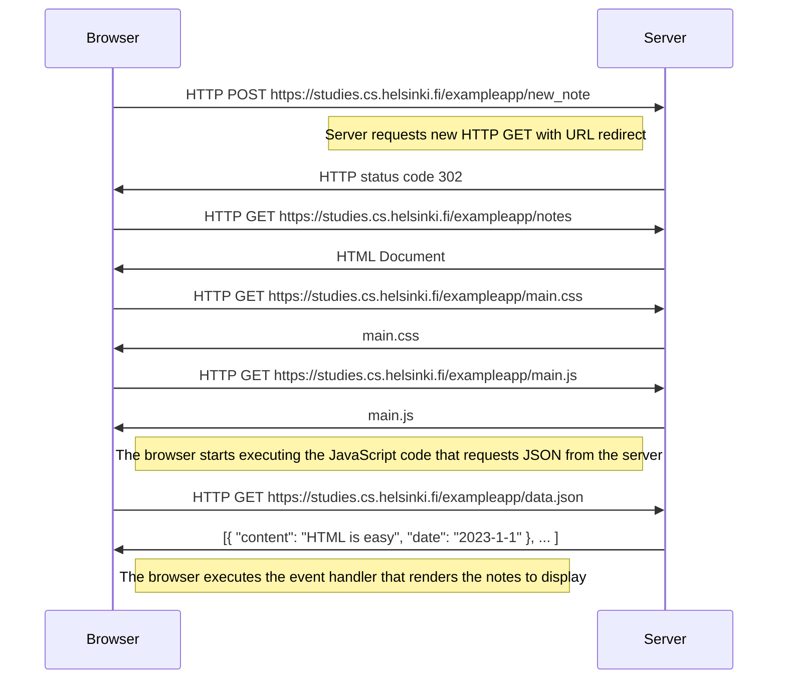

```mermaid
sequenceDiagram
Browser->>Server: HTTP POST https://studies.cs.helsinki.fi/exampleapp/new_note
Note left of Server: Server requests new HTTP GET with URL redirect
Server->>Browser: HTTP status code 302
Browser->>Server: HTTP GET https://studies.cs.helsinki.fi/exampleapp/notes
Server->>Browser: HTML Document
Browser->>Server: HTTP GET https://studies.cs.helsinki.fi/exampleapp/main.css
Server->>Browser: main.css
Browser->>Server: HTTP GET https://studies.cs.helsinki.fi/exampleapp/main.js
Server->>Browser: main.js
Note right of Browser: The browser starts executing the JavaScript code that requests JSON from the server
Browser->>Server: HTTP GET https://studies.cs.helsinki.fi/exampleapp/data.json
Server->>Browser: [{ "content": "HTML is easy", "date": "2023-1-1" }, ... ]
Note right of Browser: The browser executes the event handler that renders the notes to display
```
